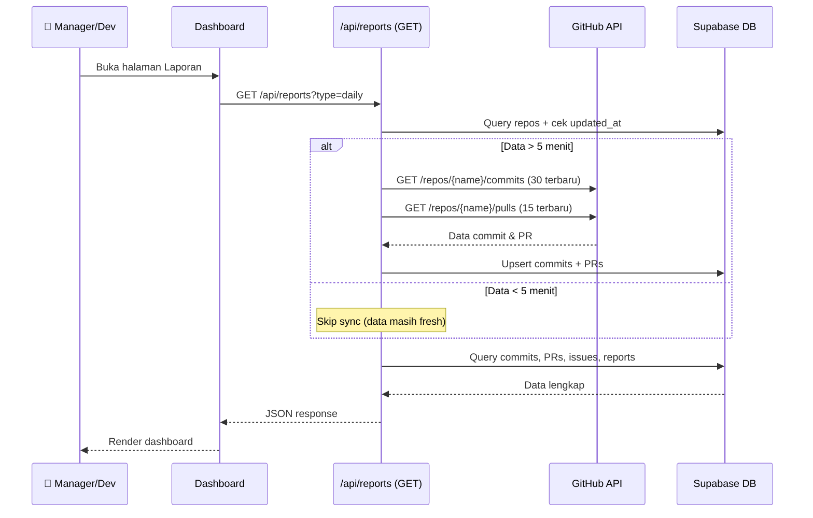
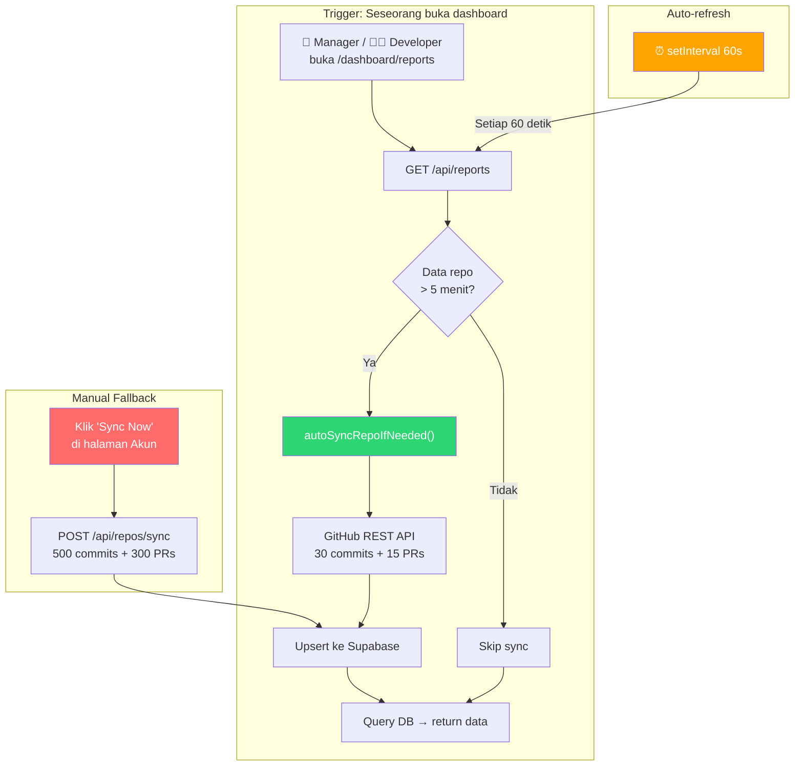
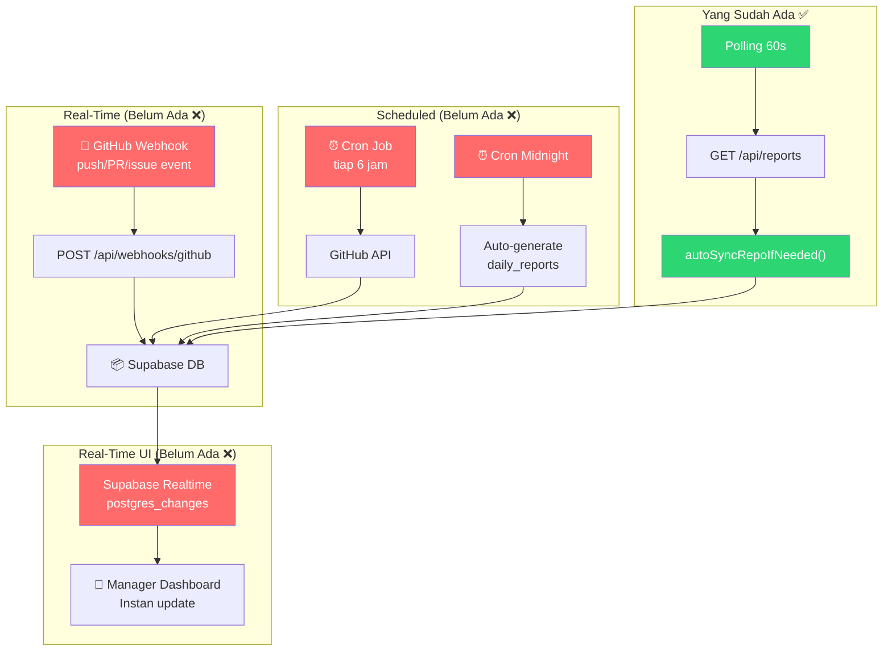

# 🔍 Audit Mendalam: Auto-Sync & Real-Time Update dari GitHub

> **Proyek**: V2 Beye Dev Report  
> **Tanggal Audit**: 13 Juni 2026  
> **Pertanyaan**: Apakah developer sudah tidak perlu klik manual sync agar management mendapat update real-time dari GitHub?

---

## ✅ Jawaban Singkat

> [!IMPORTANT]
> **SEBAGIAN SUDAH OTOMATIS, tapi BELUM sepenuhnya real-time.** Proyek ini sudah memiliki mekanisme **auto-sync on page load** + **polling 60 detik**. Developer **tidak perlu klik "Sync Now"** selama dashboard laporan dibuka — data akan otomatis ditarik dari GitHub setiap kali data lebih dari 5 menit. Namun, ini masih jauh dari arsitektur ideal (webhook + cron).

---

## 📊 Peta Status Implementasi

| Fitur | Status | Cara Kerja |
|---|---|---|
| **Auto-sync saat halaman dibuka** | ✅ Sudah Ada | `autoSyncRepoIfNeeded()` di [/api/reports](file:///D:/DEV/2026/V2%20Beye%20Dev%20Report/src/app/api/reports/route.ts#L8-L94) — otomatis sync jika data > 5 menit |
| **Polling 60 detik** | ✅ Sudah Ada | [dashboard/reports/page.tsx](file:///D:/DEV/2026/V2%20Beye%20Dev%20Report/src/app/dashboard/reports/page.tsx#L73-L78) — `setInterval(fetchReportData, 60_000)` |
| **Manual Sync per repo** | ✅ Sudah Ada | Tombol "Sync Now" di [accounts/page.tsx](file:///D:/DEV/2026/V2%20Beye%20Dev%20Report/src/app/accounts/page.tsx) → [/api/repos/sync](file:///D:/DEV/2026/V2%20Beye%20Dev%20Report/src/app/api/repos/sync/route.ts) |
| **GitHub Webhook** (push event) | ❌ Belum Ada | Tidak ada endpoint `/api/webhooks/github` |
| **Cron/Scheduled Sync** | ❌ Belum Ada | Tidak ada Vercel Cron atau scheduler |
| **Supabase Realtime** | ❌ Belum Ada | Client tidak subscribe ke perubahan DB |
| **GitHub OAuth** | ⚠️ Partial | Config ada di [auth.ts](file:///D:/DEV/2026/V2%20Beye%20Dev%20Report/src/auth.ts), tombol login ada, tapi `GITHUB_CLIENT_ID` dan `GITHUB_CLIENT_SECRET` masih kosong di [.env.local](file:///D:/DEV/2026/V2%20Beye%20Dev%20Report/.env.local#L16-L17) |
| **PR Sync** | ✅ Sudah Ada | Auto-sync & manual sync keduanya mengambil Pull Requests |
| **Issues Sync** | ❌ Belum Ada | Tabel `issues` ada tapi tidak pernah diisi dari GitHub |

---

## 🔎 Analisis Mendalam: 3 Mekanisme Sync yang Ada

### Mekanisme 1: Auto-Sync on Page Load ✅

**Lokasi**: [/api/reports/route.ts → autoSyncRepoIfNeeded()](file:///D:/DEV/2026/V2%20Beye%20Dev%20Report/src/app/api/reports/route.ts#L8-L94)



**Kode kunci** (line 8-17):
```typescript
async function autoSyncRepoIfNeeded(repo: any) {
  const FIVE_MINUTES_MS = 5 * 60 * 1000;
  const lastUpdated = repo.updated_at ? new Date(repo.updated_at).getTime() : 0;
  const now = Date.now();
  if (now - lastUpdated < FIVE_MINUTES_MS) return; // Skip jika < 5 menit
  // ... fetch dari GitHub & simpan ke DB
}
```

**Dipanggil untuk semua user** (line 170-171 untuk Manager, line 388-389 untuk Developer):
```typescript
// Manager: sync SEMUA repo visible
await Promise.all(repos.map(repo => autoSyncRepoIfNeeded(repo)));
```

### Mekanisme 2: Polling 60 Detik ✅

**Lokasi**: [dashboard/reports/page.tsx](file:///D:/DEV/2026/V2%20Beye%20Dev%20Report/src/app/dashboard/reports/page.tsx#L73-L78)

```typescript
// Initial fetch + auto-refresh every 60s for realtime-like experience
useEffect(() => {
  fetchReportData();
  const interval = setInterval(() => fetchReportData(true), 60_000);
  return () => clearInterval(interval);
}, [fetchReportData]);
```

> [!NOTE]
> Setiap 60 detik, dashboard otomatis memanggil `GET /api/reports`, yang akan trigger `autoSyncRepoIfNeeded()`. Jadi efektifnya: **data di-refresh dari GitHub setiap ≤5 menit selama dashboard terbuka**, tanpa perlu klik apapun.

### Mekanisme 3: Manual Sync (Fallback) ✅

**Lokasi**: [/api/repos/sync/route.ts](file:///D:/DEV/2026/V2%20Beye%20Dev%20Report/src/app/api/repos/sync/route.ts) + [accounts/page.tsx](file:///D:/DEV/2026/V2%20Beye%20Dev%20Report/src/app/accounts/page.tsx)

- Tombol "Sync Now" per repo di halaman Akun GitHub
- Sync lebih banyak data (hingga 500 commits + 300 PRs)
- Berguna untuk initial sync atau sync besar-besaran

---

## 📋 Matriks Skenario: Kapan Developer Perlu Klik Manual?

| Skenario | Perlu Klik Manual? | Penjelasan |
|---|---|---|
| Manager buka dashboard | ❌ **Tidak perlu** | `autoSyncRepoIfNeeded()` otomatis jalan saat GET /api/reports |
| Developer buka dashboard | ❌ **Tidak perlu** | Sama — auto-sync otomatis |
| Dashboard tetap terbuka | ❌ **Tidak perlu** | Polling 60 detik menjaga data tetap fresh |
| Baru connect akun GitHub | ❌ **Tidak perlu** | POST /api/accounts otomatis tarik daftar repo |
| Butuh sync >30 commits | ✅ **Perlu** | Auto-sync hanya 30 commit terbaru, manual sync bisa 500 |
| Tidak ada yang buka dashboard | ⚠️ **Data basi** | Tanpa webhook/cron, data tidak ter-sync jika tidak ada yang buka halaman |
| Push commit baru ke GitHub | ⚠️ **Delay 1-5 menit** | Tidak instan — harus menunggu polling cycle + cooldown habis |

---

## ⚠️ Gap & Risiko yang Ditemukan

### 🔴 Risiko Kritis

#### 1. Tidak Ada Sync Jika Tidak Ada Yang Buka Dashboard
```
Jika tidak ada yang membuka halaman laporan selama 24 jam,
maka data di database tidak ter-update sama sekali.
```
**Solusi**: Implementasi Cron Job (Vercel Cron / external scheduler)

#### 2. Rate Limit GitHub API Bisa Terlampaui
Di [route.ts line 170-171](file:///D:/DEV/2026/V2%20Beye%20Dev%20Report/src/app/api/reports/route.ts#L170-L171):
```typescript
// Manager view: auto-sync SEMUA repo visible sekaligus!
await Promise.all(repos.map(repo => autoSyncRepoIfNeeded(repo)));
```
- GitHub rate limit: **5.000 request/jam per token**
- Jika ada 20 repo × 2 API call (commits + PRs) = 40 request per load
- Polling tiap 60 detik: 40 × 60 = **2.400 request/jam**
- **Hampir setengah limit GitHub** hanya dari satu user!

**Solusi**: Batch sync, rate limit tracking, webhook-first approach

#### 3. `additions` & `deletions` Selalu 0 dari Auto-Sync
Di [route.ts line 48-49](file:///D:/DEV/2026/V2%20Beye%20Dev%20Report/src/app/api/reports/route.ts#L48-L49):
```typescript
additions: c.stats?.additions || 0,
deletions: c.stats?.deletions || 0,
```
GitHub REST API `/repos/{owner}/{repo}/commits` (list endpoint) **TIDAK mengembalikan `stats`** per commit. Anda harus memanggil endpoint individual `/repos/{owner}/{repo}/commits/{sha}` untuk mendapatkan `stats`. Akibatnya, semua commit dari auto-sync memiliki additions=0 dan deletions=0.

#### 4. Branch Selalu Hardcode 'main'
Di [route.ts line 51](file:///D:/DEV/2026/V2%20Beye%20Dev%20Report/src/app/api/reports/route.ts#L51):
```typescript
branch_name: 'main'  // ← Hardcoded!
```
Semua commit tercatat di branch 'main', padahal bisa saja dari branch lain.

### 🟡 Risiko Sedang

#### 5. Issues Tidak Pernah Di-Sync
Tabel `issues` ada di schema tapi **tidak ada API call** ke `GET /repos/{owner}/{repo}/issues` di mana pun. Dashboard management menampilkan data issues tapi selalu kosong.

#### 6. Export Laporan Masih Simulasi
Di [dashboard/reports/page.tsx line 110-122](file:///D:/DEV/2026/V2%20Beye%20Dev%20Report/src/app/dashboard/reports/page.tsx#L110-L122):
```typescript
const handleExport = (type: "pdf" | "excel" | "share") => {
  setIsExporting(type);
  setTimeout(() => {  // ← Hanya delay 2 detik, tidak ada export sungguhan
    setIsExporting("none");
    toast.success("Sukses mengekspor...");
  }, 2000);
};
```

#### 7. GitHub OAuth Belum Aktif
[.env.local](file:///D:/DEV/2026/V2%20Beye%20Dev%20Report/.env.local#L16-L17):
```env
GITHUB_CLIENT_ID=""        # ← Kosong
GITHUB_CLIENT_SECRET=""    # ← Kosong
```
Developer masih harus input Personal Access Token (PAT) secara manual.

---

## 🏗️ Arsitektur: Aktual vs Ideal

### Saat Ini (Semi-Otomatis)



### Target Ideal (Fully Automated)



---

## 🛠️ Rekomendasi Implementasi (Berurutan)

### Fase 1: Webhook GitHub (Prioritas Tertinggi) 🔴

Buat `src/app/api/webhooks/github/route.ts`:
- Terima push/PR/issue events secara instan dari GitHub
- Verifikasi signature HMAC SHA-256
- Insert ke `commits`, `pull_requests`, `issues`, `activity_events`
- **Dampak**: Data masuk instan, bukan 5 menit delay

### Fase 2: Cron Sync + Auto Daily Report 🔴

Buat `src/app/api/cron/sync/route.ts`:
- Scheduled sync tiap 6 jam (reconciliation)
- Auto-generate `daily_reports` setiap tengah malam
- **Dampak**: Data tetap fresh meski tidak ada yang buka dashboard

### Fase 3: Supabase Realtime 🟡

Tambahkan subscription di client:
```typescript
supabase.channel('new-commits')
  .on('postgres_changes', { event: 'INSERT', schema: 'public', table: 'commits' },
    (payload) => { /* tambahkan ke state tanpa refresh */ })
  .subscribe()
```
- **Dampak**: Dashboard langsung update tanpa polling, lebih efisien

### Fase 4: Perbaikan Data Quality 🟡

1. **Fix additions/deletions**: Panggil individual commit endpoint untuk stats
2. **Fix branch hardcode**: Ambil branch dari payload GitHub
3. **Sync Issues**: Tambahkan API call ke `/repos/{owner}/{repo}/issues`
4. **Aktivasi GitHub OAuth**: Isi `GITHUB_CLIENT_ID` & `GITHUB_CLIENT_SECRET`
5. **Implementasi export nyata**: PDF/Excel generation sungguhan

---

## ✅ Checklist Verifikasi Keberhasilan

### Saat Ini (Sudah Tercapai)
- [x] Auto-sync saat halaman dibuka (5-min cooldown)
- [x] Polling 60 detik untuk quasi-realtime
- [x] Manual sync sebagai fallback
- [x] Commits sync dari GitHub
- [x] Pull Requests sync dari GitHub
- [x] Enkripsi token GitHub (AES-256-GCM)
- [x] RBAC Developer vs Management view

### Belum Tercapai (Perlu Dibangun)
- [ ] Webhook endpoint `/api/webhooks/github`
- [ ] Cron job sync berkala
- [ ] Auto-generate daily report tengah malam
- [ ] Supabase Realtime subscriptions
- [ ] Issues sync dari GitHub
- [ ] Fix additions/deletions (selalu 0)
- [ ] Fix branch hardcode 'main'
- [ ] Export PDF/Excel sungguhan
- [ ] GitHub OAuth aktif (env masih kosong)
- [ ] Rate limit protection

---

> [!TIP]
> **Kesimpulan akhir**: Untuk penggunaan sehari-hari, **developer sudah tidak perlu klik manual sync** selama halaman dashboard/laporan aktif dibuka. Data akan otomatis fresh setiap 5 menit. Namun, untuk mencapai arsitektur ideal (instan, selalu up-to-date, dan tidak bergantung pada siapa yang buka dashboard), masih perlu implementasi **Webhook + Cron + Realtime** di Fase 1-3.
